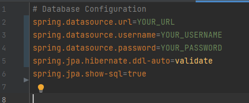

# 📃 Installation Instructions

To run the project, you need to have the following software installed on your machine:

1. Java Development Kit (JDK) 17 or later
2. Google Chrome browser

## 🔑 Setting up
1. Clone the repository to your local machine.
2. Then you need to prepare the database. (For developing this web application, MySQL was used.) Copy everything from the `database_dump.sql` file, then execute it in your DBMS.
3. To set up the project input correct credentials. In the `resourses/application.properties`, substitute the highlighted variables.

4. Build and run `TestTaskDataoxApplication`

5. The application will be accessible at `http://localhost:8080`. You can interact with the API endpoints using Postman or any other REST client.

### 🌐 API Endpoints

1. To scrape job listings and save them to the database, send a GET request to:

   http://localhost:8080/scrapeJobListings?jobFunction=<JOB_FUNCTION>

2. To retrieve all job listings from the database, send a GET request to:

   http://localhost:8080/scrapeJobListings/all

3. To retrieve all job listings from the database, sorted by a specific field (ASC sort by id default), send a GET request to:

   http://localhost:8080/scrapeJobListings?jobFunction=<JOB_FUNCTION>&sortBy=<SORT_BY>:DESC

4. To retrieve all job listings from the database, filtered by location (Remote, USA, New York, etc..), send a GET request to:

   http://localhost:8080/scrapeJobListings?jobFunction=<JOB_FUNCTION>&sortBy=postedDate&location=New%20York

Replace `<SORT_BY>` with the desired field to sort the results.

Replace `<JOB_FUNCTION>` with the desired field to sort the results.

- As an illustration, you can access a SQL database containing the outcomes of the "Software Jobs" dump, which can be downloaded from Google Drive at this link: https://drive.google.com/file/d/1pufSjCr4ARrIZtLie4ny2y69uo7dPvln/view?usp=sharing
- For example, if you make the following query: http://localhost:8080/scrapeJobListings?jobFunction=IT&sortBy=postedDate&location=New%20York, you will receive results similar to the image shown below:
  
### ✅ Available Job Functions 

1. Data Science
2. Design
3. IT
4. Legal
5. Marketing & Communications
6. Operations
7. Other Engineering
8. People & HR
9. Product
10. Quality Assurance
11. Sales & Business Development
12. Software Engineering

### ✅ Available Sort Parameters
- id (by default)
- positionName 
- organizationTitle
- laborFunction 
- description 
- postedDate
- locations
- tags 

✏️ Note: When using job functions with spaces in the URL, replace each space with %20 and each ampersand with %26. For example, Marketing & Communications should be represented as Marketing%20%26%20Communications.

✏️ Note: This job listing parser works exclusively with job vacancies from the Techstars Jobs website.   The application uses Selenium WebDriver, which interacts with the Chrome browser. By default, it uses a headless mode, so you don't need to download or configure ChromeDriver separately. The project already includes the necessary dependencies to handle WebDriver interactions.

